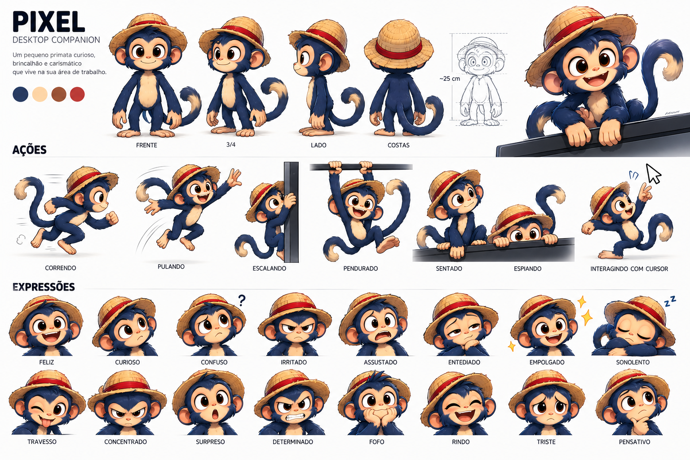
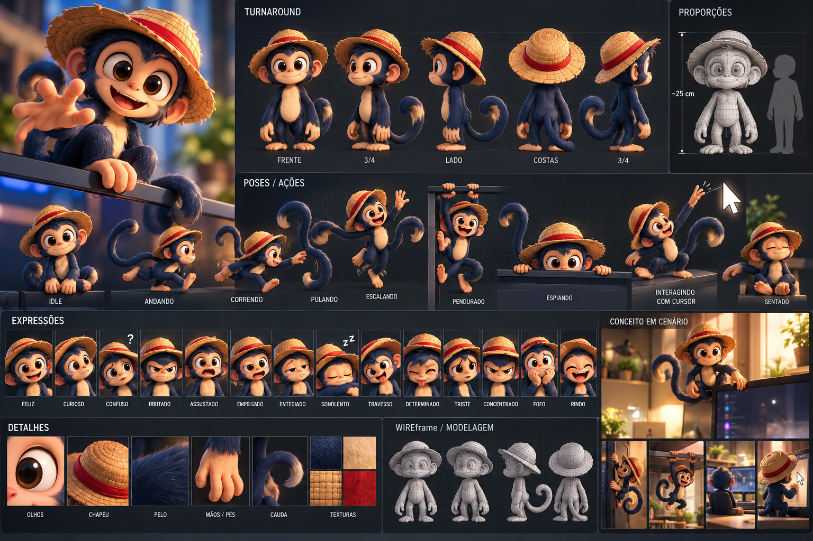

# PRODUCT_SPEC.md — Visão e escopo do Buzzy

> Referência estável do produto. Atualize quando o usuário mudar intenção ou escopo; o estado de implementação fica em PROJECT_CONTEXT.md.
>
> STATUS: PLANNED. Esta especificação descreve o produto desejado, não funcionalidades implementadas.

## Visão

Buzzy é um mascote digital interativo para desktop Windows: um companheiro moderno inspirado na sensação lúdica dos mascotes de desktop da era do BonziBuddy. Deve parecer um personagem vivendo no desktop, não uma janela convencional.

**Intenção central do usuário (2026-09-28):** Buzzy é um mascote interativo de companhia para ficar no desktop enquanto o usuário programa ou joga. Deve ser engraçado, curioso, expressivo e ativo no desktop; não é um assistente de tarefas nem um chatbot. Sua personalidade aparece por movimento, expressões, gestos e reações não verbais. Não haverá chat, campo de texto, conversa digitada ou respostas em texto. Não incluir IA no aplicativo, agora ou no plano futuro, a menos que o usuário reabra essa decisão explicitamente. Buzzy não executa tarefas gerais no computador.

Buzzy terá identidade e personagem originais. Não copiar nome, personagem, visual, voz, conteúdo ou marca de qualquer mascote existente.

O personagem conceitual é um pequeno primata arbóreo antropomórfico, amigável, curioso, brincalhão, ágil e expressivo: cabeça relativamente grande, olhos expressivos, focinho curto, orelhas arredondadas, braços longos, mãos adequadas à escalada, pernas compactas e cauda longa e expressiva. Claude está autorizado a criar a identidade visual original nesta etapa; o software começa com um placeholder estático substituível e integra as animações na Fase 6.

O usuário diz que o conceito visual do Buzzy também foi inspirado em Luffy, de *One Piece*, e quer uma personalidade livre, impulsiva, otimista, aventureira e espuleta. Use essa inspiração como direção ampla para criar um primata original, sem copiar o personagem ou seus elementos reconhecíveis — como roupa, acessórios, símbolos, falas, silhueta ou identidade visual. A identidade visual do Buzzy deve continuar própria.

**Tradução da inspiração (direção de design, STATUS: PLANNED):**

- **Tomar como espírito:** sorriso largo e fácil, postura solta e confiante, impulsividade (vai antes de pensar), otimismo, curiosidade aventureira, apetite por brincadeira e movimento exagerado e elástico como princípio de animação (antecipar, comprimir e esticar, pousar com impacto). Isso deve aparecer em poses, tempo das ações e expressões.
- **Não usar:** chapéu de palha ou faixa vermelha no chapéu (visto em uma das pranchas, Q-17), cicatriz sob o olho, colete vermelho aberto, bermuda azul, sandálias, símbolos ou bandeiras da obra, membros que esticam como poder do personagem, bordões ou falas, e a combinação de silhueta com paleta vermelho/azul/amarelo-palha que remeta ao personagem.
- **Critério de distinção:** Claude deve conferir que Buzzy é reconhecível só pela silhueta e paleta próprias, sem depender de acessório; uma pessoa que conheça *One Piece* não deve identificá-lo como versão de Luffy. Não há gate de aprovação rotineira do usuário para criar ou integrar a identidade autorizada.

### Referências visuais fornecidas pelo usuário

As duas pranchas em `assets/references/buzzy-character-concept.png` e `assets/references/buzzy-character-concept2.png` são referências para Claude criar uma identidade original e coesa para Buzzy. Não são arte final nem lista literal de requisitos. Claude está autorizado a escolher e produzir a direção visual sem aguardar aprovação; deve seguir os limites de originalidade desta especificação.

Elementos que aparecem nas pranchas — incluindo o nome "Pixel", chapéu, poses sobre superfícies, estilo de renderização, cores e acessórios — não ficam aprovados automaticamente. O nome do produto permanece Buzzy conforme esta especificação; qualquer mudança depende de decisão explícita do usuário. As poses não ampliam o escopo atual de superfícies do MVP. A proposta nova deve manter identidade visual distinta de personagens existentes, conforme DEC-002.

O cursor de mouse mostrado em uma prancha é apenas ilustrativo e não pertence ao personagem nem ao produto. As poses e animações devem corresponder às superfícies e ações previstas no MVP.

## Escopo do MVP

O MVP deve incluir:

- Um personagem visível no desktop Windows.
- Integração com desktop e janela transparente.
- Posicionamento livre na tela.
- Arraste direto pelo mouse.
- Movimento local determinístico: caminhada, escalada, salto e queda.
- Movimento autônomo pelas superfícies de borda aprovadas, escalada das laterais, pequenas pausas pendurado e travessia entre monitores com caminho válido.
- Suporte a múltiplos monitores, com travessia ligada por padrão e opção para desligar.
- Expressões separadas da lógica de movimento.
- Interação por clique e arraste. Um clique provoca uma reação não verbal; dois cliques abrem um painel compacto com o controle de energia em três posições. Não há conversa nem chat.
- Ações visuais curtas de mascote, como se espreguiçar, se coçar, espiar, brincar e descansar; não bloqueiam o uso dos aplicativos.
- Configurações e persistência local.
- Segurança, previsibilidade e desempenho adequados para uso prolongado.

O MVP começa com uma personalidade local e determinística. Curiosidade, humor e energia aparecem em ações, expressões faciais e gestos: explorar bordas, espiar, olhar ao redor, reagir a cliques e fazer pequenas travessuras. Isso não envolve observar pixels, títulos, conteúdo ou identidade de outros aplicativos. Um controle de três posições oferece **Baixa**, **Média** (padrão) e **Alta** — equivalentes a Low/Mid/High. Baixa deixa o Buzzy mais tranquilo, com pausas maiores e menos ações; Média mantém um ritmo brincalhão equilibrado; Alta aumenta a frequência e a duração das brincadeiras e reações. Os três níveis preservam as mesmas regras de movimento, segurança e prioridade do usuário. Dois cliques mostram o seletor de energia; as configurações oferecem o mesmo valor persistido.

## Decisões de produto confirmadas

As decisões abaixo foram respondidas pelo usuário entre 2026-09-26 e 2026-09-28 e detalhadas em [DECISIONS.md](DECISIONS.md). São escopo planejado, ainda não implementado:

- **Plataforma:** Windows 11, com Windows 11 24H2 ou posterior como alvo inicial de teste.
- **Janela e acesso:** sempre no topo por padrão, opção para desligar, ícone e menu na bandeja, sem botão na barra de tarefas, ocultar/restaurar pela bandeja, escala em passos fixos, sem controle de opacidade no MVP e segunda abertura revelando a instância existente. O botão direito abre o menu.
- **Controle e movimento:** clique reage com animação ou gesto; clique duplo abre um painel compacto com o seletor de energia; botão direito abre menu. O painel se reposiciona para permanecer visível e funciona por teclado e leitor de tela. No MVP, o personagem usa mouse e touchpad e percorre as superfícies das bordas das áreas úteis dos monitores: anda pelo chão e pelas bordas horizontais alcançáveis, escala paredes laterais, pode ficar pendurado por pouco tempo e atravessa monitores quando existe caminho válido. Travessia fica ligada por padrão e pode ser desligada. Ele não anda sobre janelas de outros aplicativos. Atalhos de controle, toque e caneta ficam fora do MVP.
- **Interface e configurações:** somente português do Brasil. O painel rápido de energia e a janela de configurações permitem navegação por teclado e leitor de tela; a janela do personagem não é alvo de leitor de tela. Não há interface de conversa, chat, campo de texto nem respostas escritas.
- **Preferências:** iniciar com o Windows será opcional, desligado por padrão. A energia da personalidade oferece Baixa/Média/Alta, começando em Média. O modo de tela cheia fica ligado por padrão: ao detectar uma janela em tela cheia em primeiro plano, o Buzzy vai para um monitor livre; se não houver nenhum, fica oculto até a tela cheia terminar. Ao sair desse modo, volta à posição anterior, se ela ainda existir. Se o usuário arrastar, ocultar ou mostrar o Buzzy durante o modo, a ação manual prevalece e o retorno automático não a desfaz. O usuário pode desligar o modo nas configurações. A detecção usa tela cheia como sinal prático, sem identificar jogos: apresentações e vídeos em tela cheia também podem ativá-la; jogos em janela comum não são detectados automaticamente. P7 valida o custo e os casos de tela cheia exclusiva e sem borda antes da Fase 8. Modo fantasma não entra no MVP.
- **Uso e distribuição:** uso pessoal; não há plano de divulgar ou distribuir o aplicativo pronto. O código poderá, no máximo, ficar no GitHub. O primeiro pacote para uso próprio e testes será ZIP portátil sem assinatura nem instalador. Não preparar releases binários para outras pessoas sem uma nova decisão. O modo de empacotar o runtime .NET será definido no plano de build.

## Interação e prioridade do usuário

Prioridade de controle:

1. Ação direta do usuário.
2. Menu, painel de energia e outras ações explícitas do usuário.
3. Mudanças necessárias do sistema, incluindo o modo de tela cheia aprovado em Q-09.
4. Comportamento autônomo e determinístico do mascote.

Ciclo obrigatório de arraste:

1. Mouse down inicia DRAGGING.
2. Comportamento autônomo incompatível é interrompido.
3. O personagem acompanha o cursor sem andar, pular, fugir ou iniciar escalada.
4. Mouse up valida a posição no desktop virtual.
5. O sistema identifica monitor e superfície e só então retoma comportamento permitido.

O mascote não disputa o cursor com o usuário.

O desenho de input deve distinguir clique de arraste. Teclas só afetam os controles próprios enquanto o painel de energia ou as configurações estão explicitamente em foco; não há captura global de teclado.

## Movimento, expressão e apresentação

Movimento usa máquina de estados, eventos e regras determinísticas; não depende de IA. Expressão é uma dimensão visual separada e pode mudar sem alterar a máquina de movimento.

O asset provisório não determina o formato da arquitetura. A troca futura de arte e animações deve preservar o núcleo de estado, input, movimento, desktop e segurança.

## Desktop e múltiplos monitores

O projeto deve suportar o desktop virtual real: monitores podem estar acima, abaixo, à esquerda ou à direita, com resolução, orientação e DPI diferentes. Considerar monitor primário, área útil, conexão/desconexão, mudanças de resolução/DPI e persistência de posição.

Não assumir que os monitores estão lado a lado. A Fase 0 define a abstração e os cenários verificáveis; a Fase 5 completa o tratamento de topologia e casos de borda.

## Personalidade não verbal e limites de capacidade

Buzzy expressa curiosidade e humor por movimento, poses, expressões e reações visuais locais e determinísticas. O produto não terá conversa, chat, entrada de texto, respostas escritas, voz ou reconhecimento de fala. Também não terá IA integrada, LLM, RAG, embeddings, APIs de IA, backend, atualização automática, sincronização em nuvem, telemetria ou analytics. IA no produto só volta ao plano se o usuário pedir explicitamente.

Claude pode ser usado como assistente de desenvolvimento nos modelos que o usuário escolher, incluindo Fable e Opus. Isso não é uma capacidade do produto em execução.

## Configurações e dados locais

Persistência local pode guardar configurações, última posição escolhida pelo usuário, monitor preferido, tamanho, nível de energia e preferências de comportamento aprovadas. A posição temporária usada pelo modo de tela cheia fica só em memória e não substitui essa posição persistida. Opacidade não é uma configuração do MVP. Não há memória de IA nem sincronização em nuvem. O esquema e a localização planejados estão em ARCHITECTURE.md e SECURITY.md.

## Segurança

Buzzy deve ser legítimo, previsível e auditável. O MVP não terá execução arbitrária, shell, PowerShell, CMD, keylogging, captura silenciosa de tela, processos ocultos, persistência escondida, coleta remota, downloads/execução de código desconhecido ou controle genérico de mouse/teclado.

Qualquer capacidade futura do sistema operacional deve seguir: intenção explícita → capacidade específica → permissão limitada → ação auditável. A necessidade real de permissões é definida antes da implementação.

## Desempenho

O aplicativo pode permanecer aberto por horas. Priorizar baixa atividade em idle, renderização eficiente, eventos em vez de polling desnecessário e dependências justificadas. As metas mensuráveis Q-08 foram aceitas e estão em DEC-011; continuam planejadas, ainda não verificadas no aplicativo. A Fase 11 mede os resultados.

## Decisões abertas

- Modelo detalhado de física, superfícies, animações e assets, conforme as fases correspondentes.
- Detalhes finais do formato de persistência e permissões específicas, seguindo ARCHITECTURE.md e SECURITY.md.
- Visibilidade do repositório GitHub, se o código for hospedado ali. Nenhuma distribuição de aplicativo pronto está planejada; reabrir Q-10 antes de preparar binários ou releases para outras pessoas.

Essas decisões não devem ser inventadas pelo plano de implementação. Registrar alternativas, trade-offs e recomendação antes de codificar a parte correspondente.
